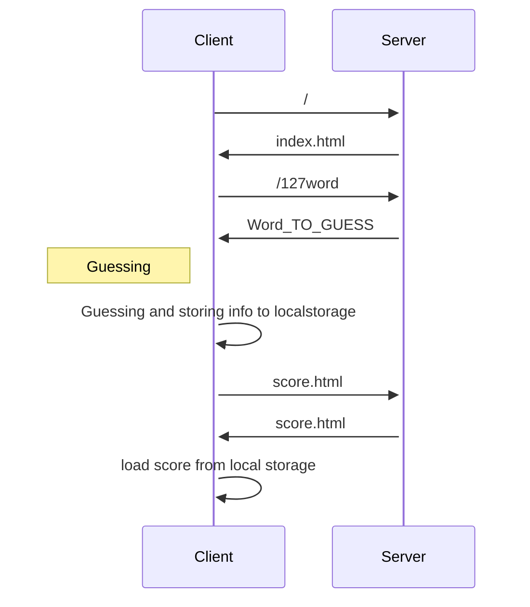

# MOTUS - Microservices 
Project made by Laurène KABA, Jonathan LOUAMBA and Ari RAJAOFERA.

---

## Description
This code consists in launching the game MOTUS where the goal of the game is to find the word of day in five tries maximum.

## How to run ?
```
 npm install
 node server.js
```
Enter this link to test the game : [Motus](http://localhost:3000)

---

## How it works ?


