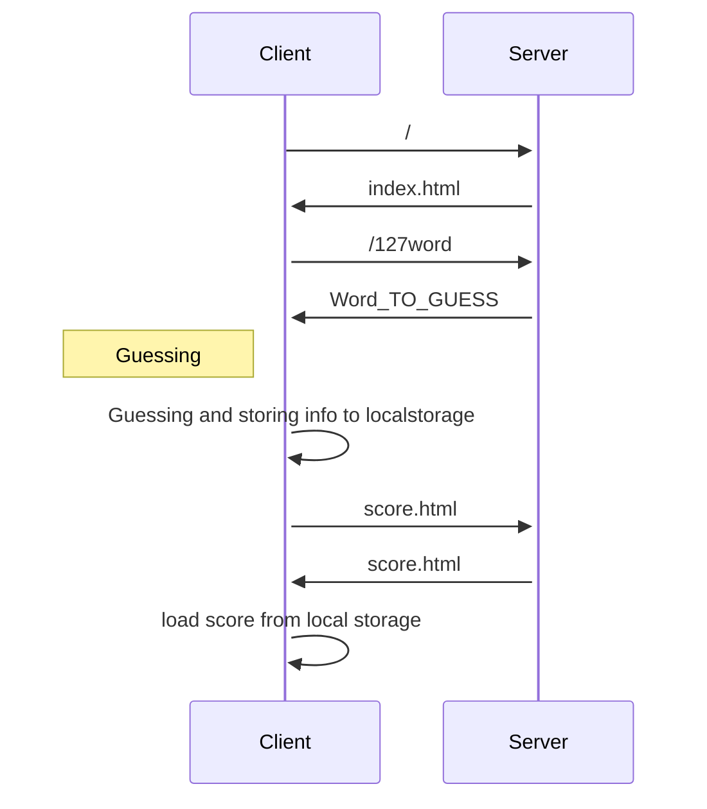

# MOTUS - Microservices 
Project made by Laurène KABA, Jonathan LOUAMBA and Ari RAJAOFERA.

---

## Description
This code consists in launching the game MOTUS where the goal of the game is to find the word of day in five tries maximum.

## How to run ?
```
 npm install
 node server.js
```
Enter this link to test the game : [Motus](http://localhost:3000)

---

## How it works ?



---

```mermaid
sequenceDiagram
    Client->>Serveur Auth:test
    Serveur Auth->>+Client : /session
    Client->>Serveur Auth:/user
    Note over Serveur Auth,Client: Redirige vers index.html si le username et le mdp correspond
    Serveur Auth->>Client: Affiche "mdp invalide" sinon
    Serveur Motus->>Client:/127word
    Serveur Motus->>Client:/new_word
    Note over Client,Serveur Motus: Envoi un mot au hasard dans la liste
    Client->>Serveur Motus:index.html
    Serveur Motus->>Client:index.html
    Serveur Motus->>Client:Word_TO_GUESS
    Note left of Client: Guessing
    Client->>Client: Guessing and storing info to localstorage
    Serveur Motus->>Serveur Score : Update score in APIStorage
    Serveur Score-->Serveur Motus : Respond success or error notification
    Serveur Motus->>Client : Word analysed
    Client->>Serveur Score:/score
    activate Serveur Score
    Client->>Client : load score from local storage
    Note over Client,Serveur Score : Score
    Serveur Score->>Serveur Score : get stat' in APIStorage
    Serveur Score->>Client : /stat
    Serveur Score->>Client : /score
    deactivate Serveur Score
    Client->>Serveur Motus : /new_word
    Serveur Motus->>Client : generate a new word to guess
 ```
 ---
 ## Feature that could be implemented
 * Run the project with Docker
 * Use a reverse proxy
